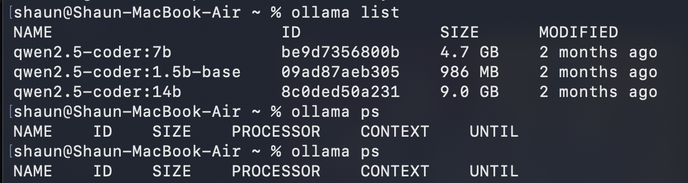
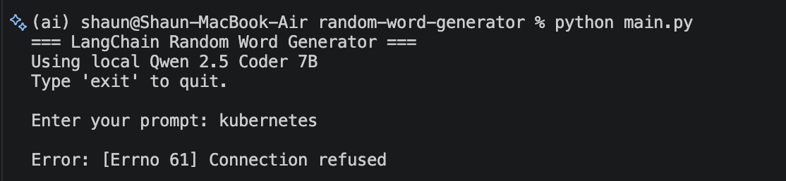
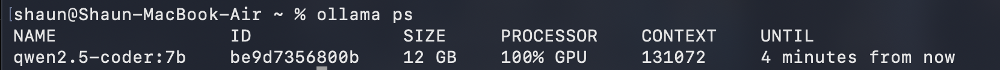
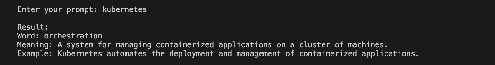

# LangChain Related Word Generator

A simple AI-powered word generator built with **Python, LangChain, Ollama, and Qwen 2.5 Coder 7B**.

The application takes a word, topic, or concept as input and generates one related word along with its meaning and an example sentence.

## How It Works

```text
User Input
    ↓
LangChain
    ↓
Ollama
    ↓
Qwen 2.5 Coder 7B
    ↓
Structured Output
    ↓
Word + Meaning + Example
```

## Example

Input:

```text
god
```

Output:

```text
Word: Deity
Meaning: A supernatural being, especially a god.
Example: The ancient Greeks worshipped many deities.
```

When the local model is not running, it will simply return Connection refused error.



When the local model is running, it will return the generated word, meaning, and example.



## Technologies

* Python
* LangChain
* LangChain Ollama
* Ollama
* Qwen 2.5 Coder 7B
* Pydantic

## Prerequisites

Make sure the following are installed:

* Python 3
* Ollama
* Qwen 2.5 Coder 7B

Pull the model with:

```bash
ollama pull qwen2.5-coder:7b
```

## Installation

Clone the repository:

```bash
git clone <your-repository-url>
cd langchain-related-word-generator
```

Install the Python dependencies:

```bash
python -m pip install -r requirements.txt
```

## Run the Application

Make sure Ollama is running and the model is available:

```bash
ollama list
```

Then run:

```bash
python main.py
```

You will see:

```text
=== LangChain Related Word Generator ===
Using local Qwen 2.5 Coder 7B
Type 'exit' to quit.

Enter your prompt:
```

Enter a word or topic such as:

```text
Kubernetes
```

or:

```text
cloud
```

or:

```text
god
```

Type `exit` to stop the application.

## Project Structure

```text
langchain-related-word-generator/
│
├── main.py
├── requirements.txt
├── README.md
└── .gitignore
```

## Future Improvements

Possible future improvements include:

* FastAPI backend
* Web-based UI
* Docker containerization
* GitHub Actions CI/CD
* Cloud deployment
* Additional LLM providers
* Conversation history
* Improved structured responses

## Purpose

This project was created as a hands-on learning project to understand how **LangChain, local LLMs, Ollama, and structured AI responses** work together.