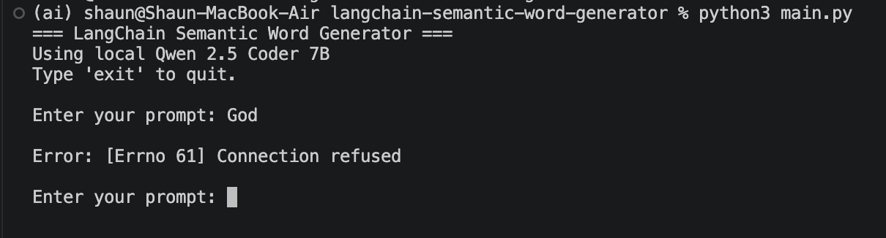
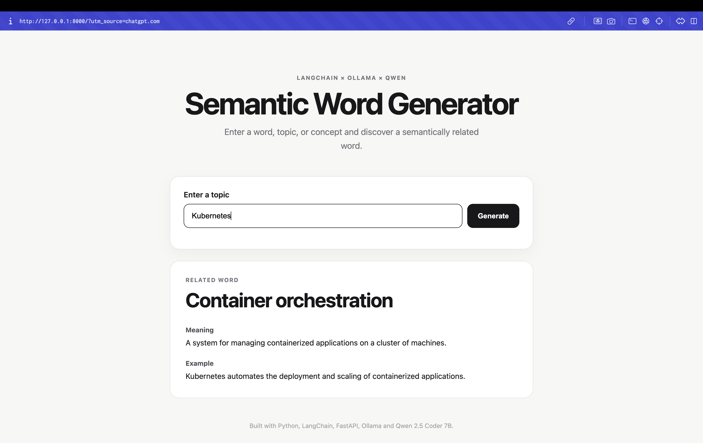

# LangChain Semantic Word Generator

# Semantic Word Generator

An AI-powered web application that uses **LangChain, FastAPI, Ollama, and Qwen 2.5 Coder 7B** to generate a semantically related word from a user-provided topic or concept.

The application returns the related word along with a simple meaning and example sentence.

---

## How It Works

```text
User
  ↓
Web UI
  ↓
FastAPI
  ↓
LangChain
  ↓
Ollama
  ↓
Qwen 2.5 Coder 7B
  ↓
Structured Output
  ↓
Word + Meaning + Example
```

## Example

Input:

```text
Kubernetes
```

Output:

```text
Word: Orchestration
Meaning: The automated management and coordination of containers or services.
Example: Kubernetes provides container orchestration.
```

When the local model is not running, it will simply return Connection refused error.




When the local model is running, it will return the generated word, meaning, and example.




## Technologies

Python
FastAPI
LangChain
LangChain Ollama
Ollama
Qwen 2.5 Coder 7B
Pydantic
HTML
CSS
JavaScript

## Prerequisites

Make sure the following are installed:

* Python 3
* Ollama
* Qwen 2.5 Coder 7B

## Installation

Clone the repository:

```bash
git clone git@github.com:ShaunGautham/langchain-semantic-word-generator.git

cd langchain-semantic-word-generator
```

Install the Python dependencies:

```bash
python -m pip install -r requirements.txt
```

## Run the Application

Make sure Ollama is running and the model is available:

```bash
ollama list
```

Start the FastAPI application:

```bash
uvicorn main:app --reload
```

The application should start at:

`http://127.0.0.1:8000`

## API Documentation

FastAPI automatically provides interactive API documentation using Swagger UI.

Open:
`http://127.0.0.1:8000/docs`

Generate Endpoint
`POST /generate`

Request
```bash
{
  "prompt": "Kubernetes"
}
```

Response
```bash
{
  "word": "Orchestration",
  "meaning": "The automated management and coordination of containers or services.",
  "example": "Kubernetes provides container orchestration."
}
```

## Architecture

```text
  Web Browser
     │
     ▼
FastAPI Webserver
     │
     ▼
 LangChain
     │
     ▼
   Ollama
Local LLM Runtime
     │
     ▼
Qwen 2.5 Coder 7B
  Local Model 
```

## Project Structure

```text
langchain-semantic-word-generator/
│
├── main.py
│
├── templates/
│   └── index.html
│
├── static/
│   ├── style.css
│   └── script.js
│
├── requirements.txt
├── README.md
└── .gitignore
```

Backend:

`main.py` contains:

* FastAPI application
* LangChain configuration
* Ollama and Qwen integration
* Pydantic response models
* `/generate` API endpoint
* Web page routing

Frontend

* `templates/index.html` contains the web page structure.
* `static/style.css` contains the UI styling.
* `static/script.js` sends requests to the FastAPI backend and displays the generated result.

## Features
* Generate a semantically related word
* Generate a simple word meaning
* Generate an example sentence
* Local LLM inference
* Structured AI output using Pydantic
* FastAPI REST API
* Simple web interface
* Interactive API documentation with Swagger UI


## Purpose

This project was created as a hands-on learning project to understand how **LangChain, local LLMs, Ollama, structured AI responses. FastAPI, REST APIs, AI-assisted development** work together.